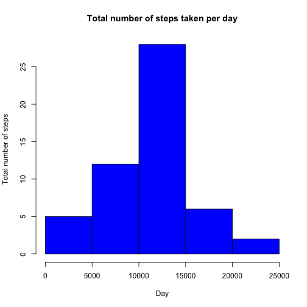
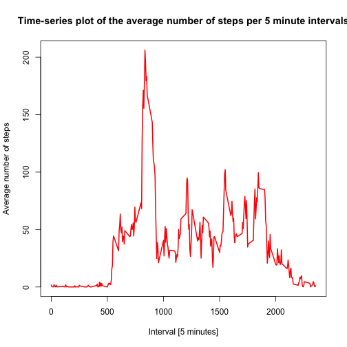
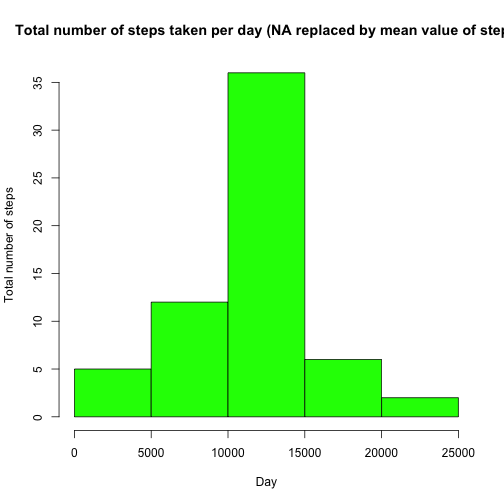
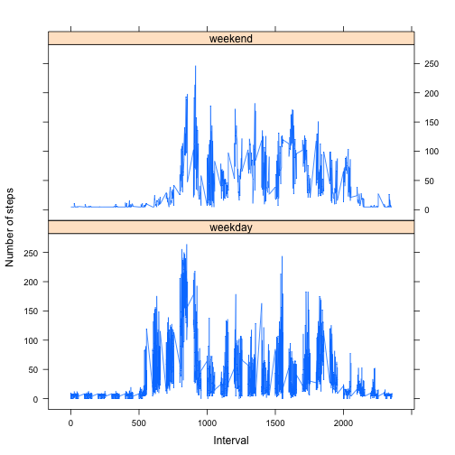

## Loading and preprocessing the data


```r
library(lattice)

if(!file.exists('activity.csv')){
  unzip('activity.zip')}
activity_data <- read.csv ('activity.csv', header = TRUE, sep = ",", colClasses=c("numeric", "character", "numeric"))

activity_data$date <- as.Date(activity_data$date, "%Y-%m-%d")
new_data <- na.omit(activity_data)
```

## What is mean total number of steps taken per day?


```r
total_steps <- aggregate(steps ~ date, new_data, sum)
names(total_steps) <- c("date", "total_steps")

hist(total_steps$total_steps, main = "Total number of steps taken per day", xlab = "Day", ylab = "Total number of steps", col = "blue")
```



```r
mean(total_steps$total_steps)
```

```
## [1] 10766.19
```

```r
median(total_steps$total_steps)
```

```
## [1] 10765
```

## What is the average daily activity pattern?


```r
average_data <- aggregate(new_data$steps, by=list(new_data$interval), mean)
names(average_data) <- c("interval", "average")

plot(average_data$interval, average_data$average, type="l", col="red", lwd=2,
     xlab="Interval [5 minutes]", ylab="Average number of steps", 
     main="Time-series plot of the average number of steps per 5 minute intervals")
```



```r
average_data[average_data$average == max(average_data$average),]
```

```
##     interval  average
## 104      835 206.1698
```

## Imputing missing values


```r
imputed_data <- activity_data

total_na <- sum(is.na(imputed_data))
position_of_na <- which(is.na(imputed_data$steps))
replace_vector <- rep (mean(imputed_data$steps, na.rm=TRUE), times=length(position_of_na))
imputed_data[position_of_na, "steps"] <- replace_vector

sum_steps <- aggregate(steps ~ date, imputed_data, sum)
names(sum_steps) <- c("date", "total")

hist(sum_steps$total, main = "Total number of steps taken per day (NA replaced by mean value of steps", xlab = "Day", ylab = "Total number of steps", col = "green")
```



```r
mean(sum_steps$total)
```

```
## [1] 10766.19
```

```r
median(sum_steps$total)
```

```
## [1] 10766.19
```

## Are there differences in activity patterns between weekdays and weekends?


```r
imputed_data$weekdays <- factor(format(imputed_data$date, "%A"))
imputed_data$day <- factor(format(imputed_data$date, "%A"))

levels(imputed_data$weekdays) <- list(weekday = c("Monday", "Tuesday", "Wednesday", "Thursday", "Friday"), weekend = c("Saturday", "Sunday"))

avg_steps <- aggregate(imputed_data$steps, by=list(imputed_data$weekdays, imputed_data$day, imputed_data$interval), mean)
names(avg_steps) <- c("daytype", "day_of_the_week", "interval", "mean")

xyplot(avg_steps$mean ~ avg_steps$interval | avg_steps$daytype, layout = c(1, 2), type = "l", xlab = "Interval", ylab = "Number of steps")
```



